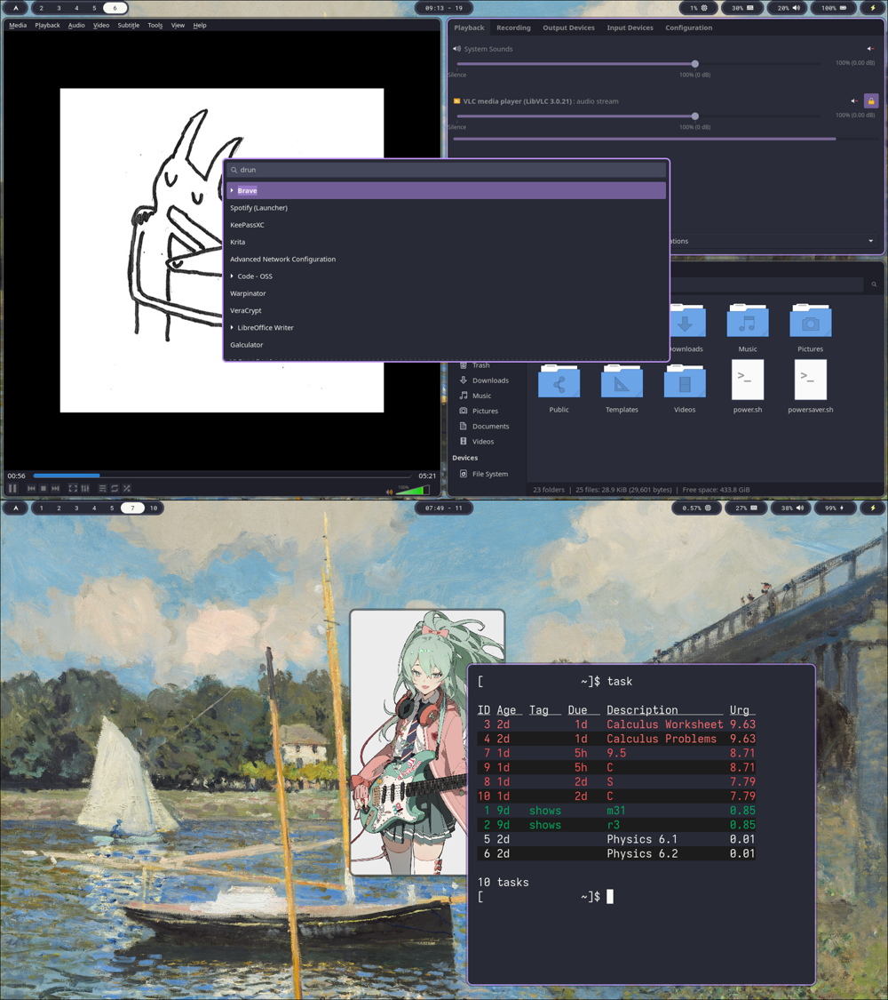

# DotFiles

I built my configuration files from defaults and from configuration files found on [Dracula Theme](https://draculatheme.com). I try to keep my code clean and not to deviate too much from defaults.

My Applications:
- Window Manager: Hyprland
- Color Scheme: Dracula
- App Launcher: Wofi
- Bar: Waybar
- Lock Screen: Hyprlock
- File Manager: Thunar
- Media Player: MPV
- Audio Player: VLC
- Image Editor: Krita

[GTK Theme - Official Dracula Theme](https://github.com/dracula/gtk)
QT Theme - QT5CT with qt5-styleplugins to mimic GTK

I have also included a couple i3 configuration files, but I don't regularly use i3 anymore, so don't expect them to be updated.

All background images included are believed to be in the public domain or fair use.
